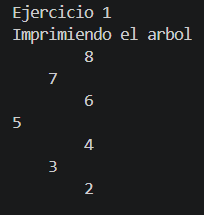
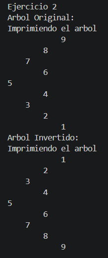
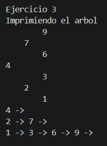
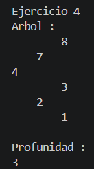

# Estructuras de Datos no Lineales

## Datos del Estudiante

- **Nombre:** Richard Japón
- **Curso:** Grupo 1
- **Fecha:** 23/06/2026

## Descripcion General del Proyecto

Este proyecto implementa un árbol binario de búsqueda (BST) en Java, aplicando operaciones fundamentales como inserción de nodos, inversión del árbol, recorrido por niveles y cálculo de la profundidad máxima. Se utilizan principalmente técnicas de recursividad y estructuras auxiliares como colas para recorrer y procesar el árbol de manera eficiente. Además, se incluye la impresión del árbol en consola para visualizar su estructura jerárquica.

## Explicacion del Ejercicio 1: Insertar en BST

- El siguiente metodo crea un arbol de enteros con **new Binary tree<>()**, luego recorre el arreglo numeros recibido como parametro e inserta cada elemento al arbol usando el metodo add. Luego llama al metodo **printTree**, para imprimir todo el arbol lo hace de forma recursiva mediante el metodo **printTreeRecursivo**, primero mostrara todo el subarbol derecho, luego el nodo actual y despues todo el subarbol izquierdo.

```java
    public void insert(int[] numeros) {

        // Crear el arbol de enteros
        // Insertar cada numero
        // Imprimir el arbol
        BinaryTree<Integer> arbolInt = new BinaryTree<>();

        for (int numero : numeros) {
            arbolInt.add(numero);
        }

        printTree(arbolInt.getRoot());

    }

    public void printTree(Node<Integer> root) {

        System.out.println("Imprimiendo el arbol");
        printTreeRecursivo(root, 0);

    }

    private void printTreeRecursivo(Node<Integer> actual, int nivel) {

        if(actual==null)
            return;

        printTreeRecursivo(actual.getRight(),nivel + 1);

        for (int i = 0; i < nivel; i++) {
            System.out.print("    ");
        }
        System.out.println(actual.getValue());
        printTreeRecursivo(actual.getLeft(), nivel + 1);

    }
```

### Salida en consola



## Explicacion del Ejercicio 2: Invertir un arbol binario

- Este metodo lo que hace es invertir todo un arbol de enteros, lo que hace es recibir la raiz del arbol como parametro, luego llama al metodo **printTree** y lo que hace este metodo es imprimir el arbol desde el subarbol derecho hasta el subarbol izquiero de manera horizontal, luego llama al metodo **printInvertidoRecursivo** y recibe la raiz como parametro, este es el metodo que invierte el arbol, lo hace intercambiando sus hijos de izquierda y derecha usando una variable auxiliar, despues de realizar el intercambio, el metodo se vuelve a llamar para los nuevos subarboles izquierdo y derecho hasta llegar a los nodos null que representan el caso base. Al final, vuelve a llamar al metodo **printTree** para imprimir el arbol ya invertido.

```java
    public void invertBinaryTree(Node<Integer> root) {

        System.out.println("Arbol Original:");
        printTree(root);

        printInvertidoRecursivo(root);

        System.out.println("Arbol Invertido:");
        printTree(root);

    }

    public void printTree(Node<Integer> root) {

        System.out.println("Imprimiendo el arbol");
        printTreeRecursivo(root, 0);

    }

    private void printTreeRecursivo(Node<Integer> actual, int nivel) {

        if (actual == null)
            return;

        printTreeRecursivo(actual.getRight(), nivel + 1);

        for (int i = 0; i < nivel; i++) {
            System.out.print("    ");
        }

        System.out.println(actual.getValue());
        printTreeRecursivo(actual.getLeft(), nivel + 1);

    }

    private void printInvertidoRecursivo(Node<Integer> actual) {

        if (actual == null)
            return;

        Node<Integer> aux = actual.getLeft();
        actual.setLeft(actual.getRight());
        actual.setRight(aux);

        printInvertidoRecursivo(actual.getLeft());
        printInvertidoRecursivo(actual.getRight());

    }
```

### Salida en consola



## Explicacion del ejercicio 3: Listar niveles del arbol

- Este método lo que hace es recorrer un árbol binario por niveles. Recibe la raíz del árbol como parámetro y crea una lista llamada resultado, que almacenará todos los niveles del árbol. Si la raíz es null, devuelve la lista vacía. Luego, crea una **cola** llamada **cola** y agrega la raíz utilizando el método **offer**. Mientras la cola no esté vacía, obtiene la cantidad de nodos que hay en el nivel actual mediante size y crea una lista llamada nivel para almacenar dichos nodos. Después, recorre todos los nodos de ese nivel. En cada iteración, extrae un nodo de la cola con poll, lo agrega a la lista nivel y verifica si tiene hijo izquierdo o derecho. Si existen, los agrega a la cola para procesarlos en el siguiente nivel. Una vez procesados todos los nodos del nivel actual, agrega la lista nivel a la lista resultado. Este proceso se repite hasta que la cola quede vacía.Al final, el método printLevels llama al método listLevels, obtiene la lista con todos los niveles y los imprime recorriendo cada nivel y mostrando el valor de cada nodo.

```java
    public List<List<Node<Integer>>> listLevels(Node<Integer> root) {

        List<List<Node<Integer>>> resultado = new ArrayList<>();
        if (root == null) {
            return resultado;
        }
        Queue<Node<Integer>> cola = new LinkedList<>();
        cola.offer(root);
        while (!cola.isEmpty()) {
            int size = cola.size();
            List<Node<Integer>> nivel = new ArrayList<>();
            for (int i = 0; i < size; i++) {
                Node<Integer> actual = cola.poll();
                nivel.add(actual);
                if (actual.getLeft() != null) {
                    cola.offer(actual.getLeft());
                }
                if (actual.getRight() != null) {
                    cola.offer(actual.getRight());
                }
            }
            resultado.add(nivel);
        }
        return resultado;
    }

        public void printLevels(Node<Integer> root) {

        List<List<Node<Integer>>> niveles = listLevels(root);
        for (List<Node<Integer>> nivel : niveles) {
            for (Node<Integer> nodo : nivel) {
                System.out.print(nodo.getValue() + " -> ");
            }
            System.out.println();
        }

    }
```

### Salida en consola



## Explicacion del ejercicio 4: Calcular profundidad maxima

- Este metodo recibe la raíz del árbol como parámetro y verifica si es null; si lo es, retorna 0, ya que un árbol vacío no tiene profundidad. Si la raíz no es null, llama recursivamente al mismo método para calcular la profundidad del subárbol izquierdo y la almacena en la variable **leftDepth**. De igual manera, calcula la profundidad del subárbol derecho y la almacena en la variable **rightDepth**. Al final, utiliza el método **Math.max** para obtener la mayor profundidad entre ambos subárboles y le suma 1, que representa el nodo actual. El valor obtenido corresponde a la profundidad máxima del árbol y es el que retorna el método.

```java
    public int maxDepth(Node<Integer> root) {

        if (root == null) {
            return 0;
        }

        int leftDepth = maxDepth(root.getLeft());
        int rightDepth = maxDepth(root.getRight());

        return Math.max(leftDepth, rightDepth) + 1;

    }
```

### Salida en consola



## Conclusiones

- **Conclusion 1:** La recursividad simplifica la implementación de algoritmos sobre árboles binarios, reduciendo la complejidad del código y facilitando el recorrido de sus nodos. Además, permite modificar la estructura del árbol de manera sencilla, realizando operaciones como la inversión de sus nodos y el recorrido completo de sus subárboles de forma eficiente.

- **Conclusion 2:** El uso de estructuras auxiliares, como las colas, facilita la implementación de algoritmos de recorrido por niveles, permitiendo procesar los nodos según su profundidad dentro del árbol.

- **Conclusion 3:** La práctica permitió comprender el funcionamiento de las estructuras no lineales, en especial los árboles binarios, entendiendo cómo se organizan jerárquicamente los nodos y cómo se aplican distintos recorridos para procesar la información.
